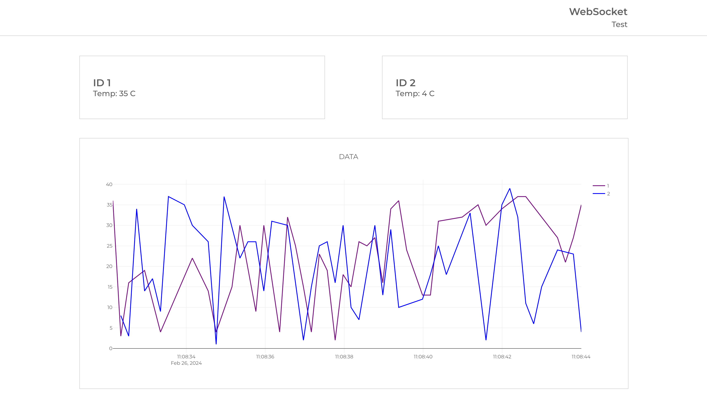

# Frontend app using WebSocket and react-plotly

A React App that connects to the WebSocket and presents the obtained data on a plot.

The plot and temperature values should be updated each time a new data is received from the socket.
If data value is bigger than 100 do not present it on the plot.
Add toast that indicates connection and disconnection of the socket.
Save 5 minutes data, so the time range on a plot should not be more than 5 min, no need to save data between sessions.
Unit tests are optional.

# Local run
1. Download the local WebSocket server that generates data here: https://github.com/and-dzh3/ws-srv
2. Follow the server project README file to run the server locally.
3. Run this (frontend) project locally with: `npm start`
4. View the project locally at http://localhost:3000

